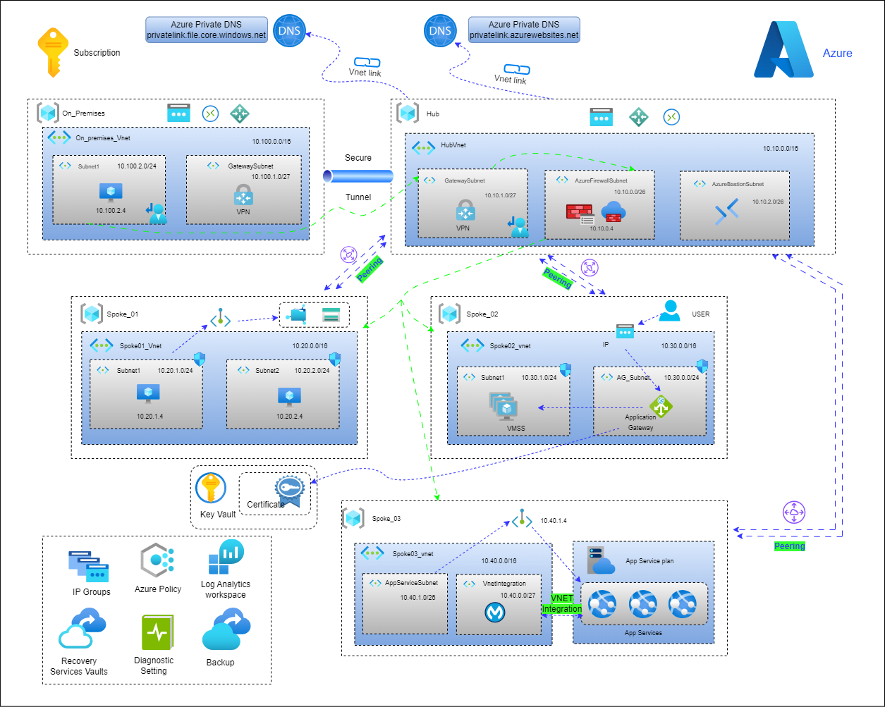

# Hub-spoke network topology in Azure :

[](https://azure.microsoft.com/en-us/resources/cloud-computing-dictionary/what-is-azure) [](https://learn.microsoft.com/en-us/azure/virtual-network/virtual-networks-overview) [](https://learn.microsoft.com/en-us/azure/firewall/overview) [](https://learn.microsoft.com/en-us/azure/bastion/bastion-overview) [](https://learn.microsoft.com/en-us/azure/vpn-gateway/vpn-gateway-about-vpngateways) 

#### Description :
This project will implement an Azure [Hub and Spoke](https://learn.microsoft.com/en-us/azure/cloud-adoption-framework/ready/azure-best-practices/hub-spoke-network-topology) architecture to support a student details application, focusing on security and efficiency. This architecture will feature a centralized hub for shared resources and multiple spoke networks for isolated environments, ensuring high availability and resiliency. Key elements include guard rails to enforce governance, robust security measures including encryption and firewalls, and comprehensive monitoring and logging capabilities. The solution will also incorporate backup and recovery strategies to protect data integrity and ensure business continuity. 


#### Steps :
- 1.We need to create the On_Premises , Hub , Spoke_01 , Spoke_02 , Spoke_03 networks.
- 2.Hub is the central point of connectivity between Hub and Spoke networks.
- 3.The On_premises network establish the connection to Hub network through the internet using VPN Gateway (S2S).
- 4.The Spoke_01 network establish the connection to Hub network by VNET Peering.
- 5.The Spoke_02 network establish the connection to Hub network by VNET Peering.
- 6.The Spoke_01 should communicates Spoke_02 through Hub network. 
- 7.All VMs must have daily backups enabled. 
- 8.Regional replication must be enabled for all VM backups to ensure data redundancy. 
- 9.All Azure Policies should be scoped to the Resource Group level. 
- 10.All VMs should remain private, without public IP addresses.
- 11.All logs should go to Log Analytic workspace.

## Architecture Diagram :



### Workflow :
This hub-spoke network configuration uses the following architectural elements:

**Hub virtual network:**  The hub [virtual network](https://learn.microsoft.com/en-us/azure/virtual-network/virtual-networks-overview) hosts shared Azure services. Workloads hosted in the spoke virtual networks can use these services. The hub virtual network is the central point of connectivity for cross-premises networks.

**Spoke virtual networks:** Spoke virtual networks isolate and manage workloads separately in each spoke. Each workload can include multiple tiers, with multiple subnets connected through Azure load balancers. Spokes can exist in different subscriptions and represent different environments, such as Production and Non-production.

**Virtual network connectivity:** This architecture connects virtual networks by using [virtual network peering](https://learn.microsoft.com/en-us/azure/virtual-network/virtual-network-peering-overview) connections or connected groups. Peering connections and connected groups are non-transitive, low-latency connections between virtual networks. Peered or connected virtual networks can exchange traffic over the Azure backbone without needing a router. Azure Virtual Network Manager creates and manages network groups and their connections.

**Azure Firewall:** An Azure Firewall managed firewall instance exists in its own subnet.

### Components:
**[Virtual Network:](https://learn.microsoft.com/en-us/azure/virtual-network/virtual-networks-overview)** Azure Virtual Network is the fundamental building block for private networks in Azure. Virtual Network enables many Azure resources, such as Azure VMs, to securely communicate with each other, cross-premises networks, and the internet.

**[Azure Firewall:](https://learn.microsoft.com/en-us/azure/firewall/overview)** Azure Firewall is a managed cloud-based network security service that protects Virtual Network resources. This stateful firewall service has built-in high availability and unrestricted cloud scalability to help you create, enforce, and log application and network connectivity policies across subscriptions and virtual networks.

**[VPN Gateway:](https://learn.microsoft.com/en-us/azure/vpn-gateway/vpn-gateway-about-vpngateways)** VPN Gateway is a specific type of virtual network gateway that sends encrypted traffic between a virtual network and an on-premises location over the public internet. You can also use VPN Gateway to send encrypted traffic between Azure virtual networks over the Microsoft network.

**[Azure Monitor:](https://learn.microsoft.com/en-us/azure/azure-monitor/overview)** Azure Monitor can collect, analyze, and act on telemetry data from cross-premises environments, including Azure and on-premises. Azure Monitor helps you maximize the performance and availability of your applications and proactively identify problems in seconds.

<h4 style= "color : skyblue">Azure Networking:</h4>


[Azure reserves the first four addresses and the last address, for a total of five IP addresses within each subnet.](https://learn.microsoft.com/en-us/azure/virtual-network/virtual-networks-faq#are-there-any-restrictions-on-using-ip-addresses-within-these-subnets)

For example, the IP address range of 10.10.1.0/24 has the following reserved addresses:

- 10.10.1.0: Network address.
- 10.10.1.1: Reserved by Azure for the default gateway.
- 10.10.1.2, 10.10.1.3: Reserved by Azure to map the Azure DNS IP - addresses to the virtual network space.
- 10.10.1.255: Network broadcast address.

### Virtual Network Subnets:
#### GatewaySubnet:
The virtual network gateway requires a specific subnet named <mark>GatewaySubnet</mark>. The gateway subnet is part of the IP address range for your virtual network and contains the IP addresses that the virtual network gateway resources and services use. It's best to specify /27 or larger (/26, /25, etc.) for your gateway subnet.
#### AzureFirewallSubnet:
The AzureFirewallSubnet is a specialized subnet in Azure Virtual Network for hosting the Azure Firewall, a cloud-based network security service.Requires at least a /26 subnet (64 IP addresses).<mark>This subnet doesn't support network security groups (NSGs)</mark>.


### Feedback
**Was this document helpful?** </br>
[](#) [](#)


<div align="right"><h4>Written By,</h4>
<a href="https://www.linkedin.com/in/seenu2002/">V.Srinivasan</a>
<h6>Cloud Engineer Intern @ CloudSlize</h6>
</div>

<div align="center">


[](#)

</div>

<details>
<summary>dedicated subnets</summary>
<h6>Azure Virtual Machines</h6>
<h6>Azure Application Gateway</h6>
<h6>Azure Kubernetes Service</h6>
<h6>Azure VPN Gateway</h6>
<h6>Azure Firewall</h6>
<h6>Azure Bastion</h6>
<h6>Azure SQL Database Managed Instance</h6>
<h6>Azure Container Instances</h6>
</details>


<details><summary><b>powershell</b></summary><br>

```console
tenv completion powershell | Out-String | Invoke-Expression
```
</details>


